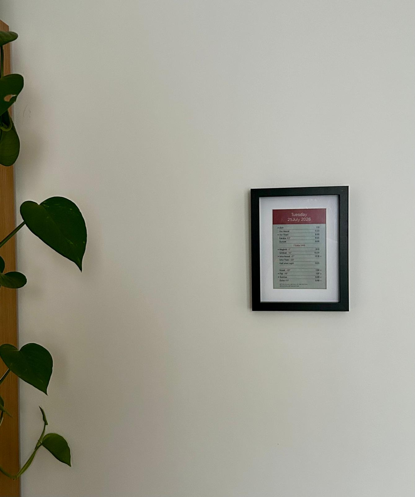
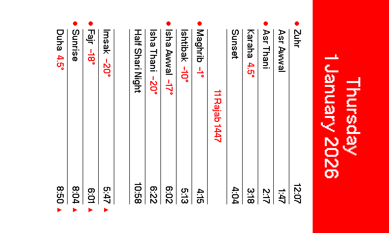
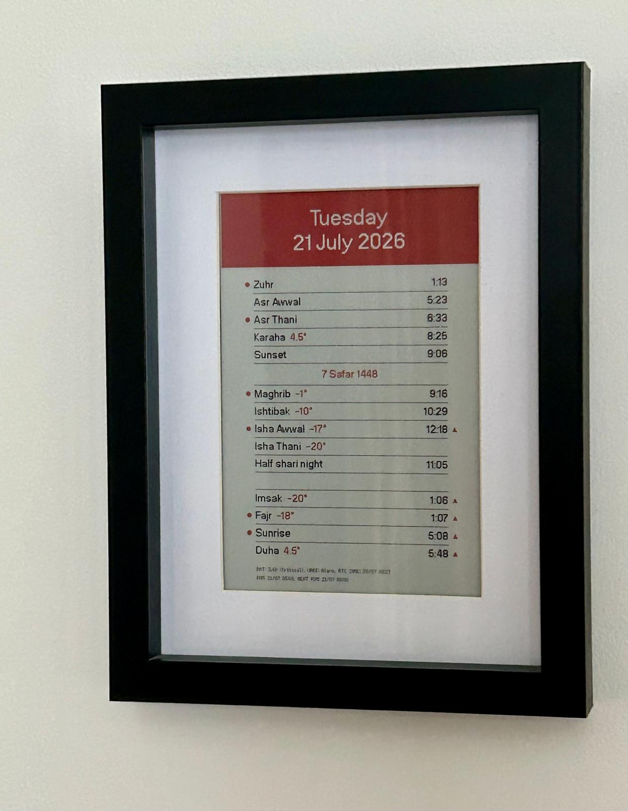
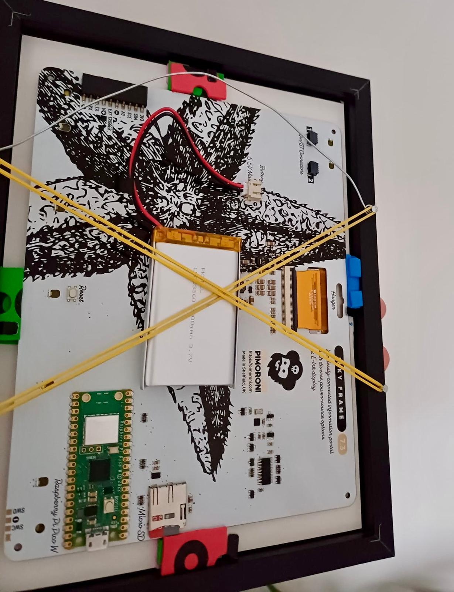

# Ruzname
### Salah Calendar for Pimoroni Inky Frame 7.3"

Ruzname is an e-paper salah calendar powered by a **Pimoroni Inky Frame 7.3"**. Daily prayer time images are generated as PNGs using [Muwaqqit](https://www.muwaqqit.com) and loaded onto the Inky Frame. The Inky Frame wakes up daily via its real-time clock (RTC), displays the current day's PNG, schedules a wakeup alarm for tomorrow, and cuts its power to conserve battery.

<p align="center">
  
</p>

---

## Hardware

*   **Display & Board:** Inky Frame 7.3" (Pimoroni) [requires Micro-USB data cable for connecting to Thonny]
*   **Battery:** LiPo Battery Pack 2000mAh (Pimoroni)
*   **Charger:** LiPo Amigo - LiPo/LiIon Battery Charger (Pimoroni) [requires USB-C cable for charging]
*   **Frame:** 6" x 8" Oslo Black Picture Frame (Home Bargains)
*   **Storage:** MicroSD Card [requires card reader for loading generated images]

---

## Directory Structure

*   `generate.py`: The Python script that fetches prayer times and generates daily calendar images.
*   `main.py`: The MicroPython code running on the Inky Frame that manages power, loads images, and sets the wakeup alarm.
*   `PPNeueBit-Bold.otf`: The font used for the calendar layout.
*   `secrets.py`: Wi-Fi network credentials file (example template included).
*   `muwaqqit/`: Directory for generated `YYYY-MM-DD.png` calendar images (includes `2026-01-01.example.png` as a reference example).
*   `requirements.txt`: Python package requirements.

## Project Architecture

The system consists of two main components:
*   **Image Generator (`generate.py`):** Runs on your computer to pre-render e-paper calendar images in bulk (`YYYY-MM-DD.png`) using the Muwaqqit API. These are then saved to an SD card.
*   **Display Script (`main.py`):** Runs on the Inky Frame using MicroPython to wake up daily via RTC, render the day's image from the SD card, schedule tomorrow's wakeup alarm, and cut power.

---

## Component 1: Image Generator (`generate.py`)

`generate.py` runs on your local computer to pre-generate calendar images for the Inky Frame.

### 1. Configuration Constants
*   `OUTPUT_DIR`: Directory where generated images are saved (defaults to `"muwaqqit"`).
*   `FONT_PATH`: Path to the custom TrueType/OpenType font (defaults to `"PPNeueBit-Bold.otf"`).
*   `MUWAQQIT_URL`: Your Muwaqqit parameter URL, which defines your location (latitude/longitude), timezone, elevation, and calculation angles (defaults to Buckingham Palace).

### 2. Command Line Options
*   `--start`: Start date in `YYYY-MM-DD` format (defaults to today's local date).
*   `--end`: End date in `YYYY-MM-DD` format (defaults to `--start` date if omitted).

### 3. Data Fetching (`fetch_data`)
*   Queries the **Muwaqqit API** for prayer times.

### 4. Layout
*   **Time Offsets & Formatting:** Converts raw API times to 12-hour `H:MM` format, applies rounding offsets (e.g. +1 min).
*   **Typography:** Renders the calendar using `PPNeueBit-Bold.otf`.
*   **Banner Colors:** Header background switches color based on the day of the week:
    *   **Red:** Weekdays (Monday – Friday)
    *   **Blue:** Weekends (Saturday – Sunday)
*   **1-Bit Mask Rendering:** To prevent blurriness and antialiasing on e-paper, text is drawn onto 1-bit monochrome masks before pasting into the color canvas.
*   **Visual Indicators:**
    *   **Red Bullets:** Highlights primary prayer rows (Fajr, Sunrise, Zuhr, Asr Thani, Maghrib, Isha Awwal).
    *   **Red Triangles:** Marks prayer times that roll over midnight into the next Gregorian day.
*   **Rotation:** Rotates the 480×800 canvas by -90° (`ROTATE_270`).
*   **Quantization:** Quantizes to the final 7-color Inky Frame palette.
*   **Output:** Saves generated images to `muwaqqit/YYYY-MM-DD.png`.

### 5. Example PNG Output

<p align="center">
  <br>
</p>

---

## Component 2: Display Script (`main.py`)

`main.py` runs on the Inky Frame using MicroPython.

### 1. Configuration Constants
*   `WAKE_HOUR`: Daily wakeup hour in **UTC** (0–23, defaults to `9` UTC).
*   `WAKE_MINUTE`: Daily wakeup minute (0–59, defaults to `0`).

### 2. Board Status
*   **VSYS Hold (GP2):** The first line of code sets `GP2` high to latch power on, keeping the board running when the wake button is released.
*   **Status LEDs:**
    *   **Processing LED:** Pulses during activity and turns off right before power cut.
    *   **Wi-Fi LED:** Flashes once per second while attempting Wi-Fi connection.

### 3. RTC Clock Sync
*   Loads time from the external **PCF85063A RTC** into the internal Pico W clock.
*   **30-Day Sync Schedule:** Checks `/last_sync_epoch.txt` and connects to Wi-Fi to sync with NTP servers once every 30 days to save battery.
*   **Manual Bypass:** Automatically syncs Wi-Fi immediately if booted manually (button press or USB power), or if the previous sync failed.
*   **Radio Shutdown:** Powers down the Wi-Fi chip (`CYW43`) immediately after clock sync to prevent background interrupts from interfering with SD card reading.

### 4. Image Decoding & Diagnostics
*   Mounts the MicroSD card at `/sd` and decodes `/sd/muwaqqit/YYYY-MM-DD.png` directly to the display using hardware `pngdec.PNG`.
*   Overlays a 2-line diagnostic bar along the bottom margin:
    *   **Line 1:** Battery voltage/state (`Full`, `Good`, `Low`, `Critical`, or `USB`), wake trigger (`Alarm`, `Button`, or `Power`), and last NTP sync date.
    *   **Line 2:** Current run timestamp and next scheduled wakeup time.

### 5. Battery Monitoring
*   **Battery Life:** A 2,000 mAh LiPo battery should power the device for over a year.
*   **Under-Voltage Lockout (UVLO):** If battery voltage drops below 3.3V, it displays a "BATTERY DEAD" screen, disables future alarms, and shuts down to protect the LiPo cell.
*   **Failsafe Alarm:** Schedules tomorrow's wake alarm inside a `finally` block to guarantee the wakeup alarm is set even if rendering crashes.
*   **Power Cut:** Disables busy LED and pulls `GP2` (VSYS Hold) low, turning off the device.

---

## Installation & Setup

### Phase 1: Generate Calendar Images
1. Open terminal in the `Ruzname` folder and set up a virtual environment (requires **Python 3.8+**):
   ```bash
   python3 -m venv env
   source env/bin/activate
   pip install -r requirements.txt
   ```
2. **Generate your Muwaqqit URL:**
   * Go to [muwaqqit.com](https://www.muwaqqit.com).
   * Enter your location, timezone, calculation method, and preferred astronomical angles.
   * Click **Calculate**.
   * Scroll to the bottom of the page and copy the **Bookmarkable link** (e.g. `https://www.muwaqqit.com/index?add=...`).
3. Open `generate.py` and paste your URL into the `MUWAQQIT_URL` constant near the top of the file. *(The script automatically converts web `index` links into API endpoints).*
4. Run the generator to create daily images (e.g., for a full year):
     ```bash
     python generate.py --start 2026-01-01 --end 2026-12-31
     ```
   *(Note: Image generation is limited to 1 year to prevent overwhelming the Muwaqqit service).*
5. This creates a `muwaqqit/` folder containing the optimized `YYYY-MM-DD.png` images.

### Phase 2: Prepare SD Card
1. Format your MicroSD card as **FAT32** with an **MBR** partition map (required by the MicroPython driver).
2. Create a folder named `muwaqqit` in the root of the card.
3. Copy all generated PNG files from your computer's `muwaqqit/` folder into the `/muwaqqit/` folder on the SD card.
4. Insert the SD card into the Inky Frame.

### Phase 3: Flash the Inky Frame (Using Thonny)

#### 1. Install Thonny IDE
Download and install [Thonny IDE](https://thonny.org) on your computer.

#### 2. Install Pimoroni MicroPython Firmware
*(Skip this step if your Inky Frame already has Pimoroni MicroPython installed)*
1. Download the latest Inky Frame MicroPython `.uf2` firmware from the [Inky Frame Releases page](https://github.com/pimoroni/inky-frame/releases) or [Pimoroni Pico Releases page](https://github.com/pimoroni/pimoroni-pico/releases). Choose the file matching your board (e.g. `pico_w_inky-v*.uf2` for Pico W or `pico2_w_inky-v*.uf2` for Pico 2 W).
2. Connect your Inky Frame to your computer via USB. Hold down the **BOOTSEL** button on the board while tapping the **Reset** button (or hold **BOOTSEL** while plugging in USB).
3. A drive named `RPI-RP2` (or `RP2350`) will appear on your computer. Drag and drop the downloaded `.uf2` file onto the drive. The Inky Frame will flash and reboot automatically.

#### 3. Connect Thonny
1. Open Thonny.
2. Go to **View** in the top menu bar and check **Files** to open the file browser panel.
3. Click the bottom-right corner of the Thonny window (or go to **Run** > **Configure interpreter...**) and select:
   * **Interpreter:** `MicroPython (Raspberry Pi Pico)`
   * **Port:** `Try to detect port automatically` (or select your board's serial port).

#### 4. Upload Files
1. In Thonny's local file browser (top-left panel), navigate to your `Ruzname` repository folder.
2. Right-click `main.py` and select **Upload to /** to upload and overwrite the default `main.py` on the Inky Frame flash root (this ensures Ruzname runs automatically whenever the board boots).
   *(Optional: Edit `WAKE_HOUR` and `WAKE_MINUTE` at the top of `main.py` before uploading to change your daily wakeup time in UTC).*
3. Open `secrets.py` on the Inky Frame flash root (double-click it in Thonny's bottom-left device file panel, or upload your local `secrets.py`) and set your 2.4 GHz Wi-Fi details:
   ```python
   WIFI_SSID = "Your_WiFi_Name"
   WIFI_PASSWORD = "Your_WiFi_Password"
   ```

#### 5. Reboot
1. Click in the Thonny **Shell** area at the bottom and press **Ctrl+D** (or click the red **Stop/Restart** icon) to soft-reboot the Pico W.
2. The onboard **Processing LED** will pulse, load the image from the SD card, and display it on screen.

---

## Completed Build Example

<p align="center">
  
  
</p>

---

## Troubleshooting

### 1. Error Screen
If a critical error occurs (such as a missing PNG or failed connection), the display renders an error message showing the traceback, then shuts down to preserve battery.

### 2. Wi-Fi Failures
The Pico W only supports **2.4 GHz** Wi-Fi networks. Make sure you are within range and your password in `secrets.py` is correct.

### 3. SD Card Corruption (Error 19: ENODEV)
If the power is cut or the USB is disconnected while the Pico is reading/writing, the SD card filesystem may become corrupted.
*   **On macOS, repair it by running:**
    ```bash
    diskutil repairVolume /dev/disk[number]
    ```
*   **If unrecoverable, reformat the card:**
    ```bash
    diskutil eraseDisk FAT32 SDCARD MBRFormat /dev/disk[number]
    ```

---

## Attribution

If you use, fork, or adapt this code or design, please properly attribute and link back to the original [Ruzname repository](https://github.com/reedwan/Ruzname).

---

## Credits

*   **Font:** **PP Neue Bit (Bold)** published by Pangram Pangram Foundry. Free for personal, non-commercial use. Commercial projects require a license from Pangram Pangram.
*   **Salah Data:** Prayer times and astronomical data provided by [Muwaqqit](https://www.muwaqqit.com).

---

## Changelog

### [1.0.0] - 2026-07-21
- Initial release of Ruzname.
